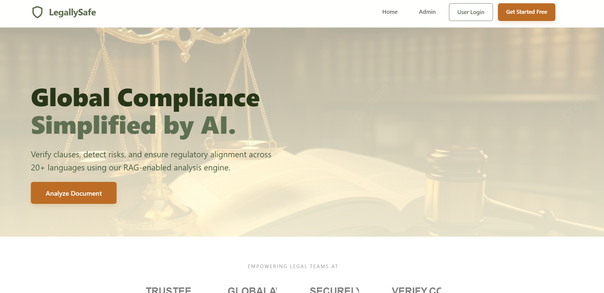
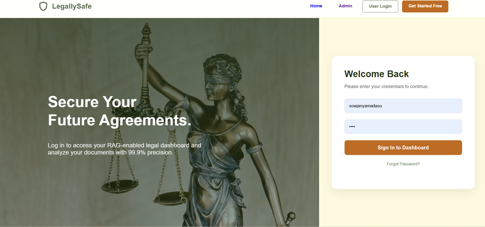
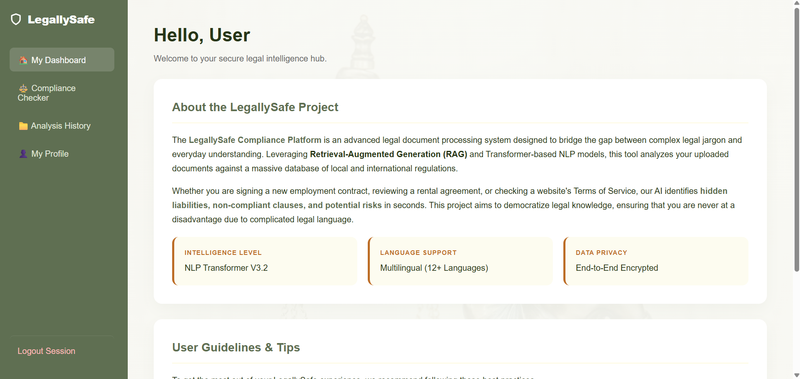
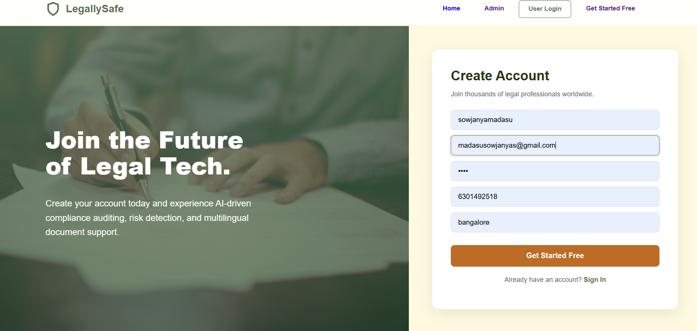

# ⚖️ Legal Compliance AI

An AI-powered web application for analyzing legal documents and detecting compliance risks using a RAG-enabled Transformer architecture.

---

## 🚀 Features
- 📄 AI-based legal document analysis  
- ⚠️ Compliance risk detection  
- 🔐 User authentication (Login system)  
- 🌐 Multilingual document support  
- 🤖 Automated answer generation using Transformers  

---

## 🛠️ Technologies Used
- Python  
- Flask  
- HuggingFace Transformers  
- HTML, CSS  

---

### Screenshots

#### Home Page

#### Login Page

#### Dashboard

#### Register

---

## ⚙️ How to Run

1. Install Python 3.10  
2. Install dependencies:
pip install torch transformers flask 
3. run the application
 python app.py
5. open the browser
http://127.0.0.1:5000 
